```{r setup, include=FALSE}
knitr::opts_chunk$set(echo = TRUE)
```

This is a phase-field solver pertaining to three phases ($\alpha$, $\beta$ and liquid) for OpenFOAM based on finite-volume discretization. The solver can be decomposed into multiple domains for parallel runs. To carry out the simulations, the steps mentioned below can be followed.

# 2D eutectic growth

The first case is conducted by subjecting the melt to a positive moving thermal gradient ahead of the solid-liquid interface in 2D. The imposed temperature field as a function of thermal gradient in the x direction, $G$ and pulling velocity, $v$ is taken as:

$$
T(x,t) = T_{initial} + G(x-vt)
\tag{1}
\label{1}
$$

## Problem specification

The problem is defined as follows:

***Solution domain*** The domain is considered to be two-dimensional in this problem. The rectangular domain consists of three phases with boundaries as shown in Figure 1 (@Umate).

```{r geomfg, echo=FALSE, out.width='50%', fig.align = 'center', fig.cap = "Figure 1: Geometry of the melt with an undercooled region."}
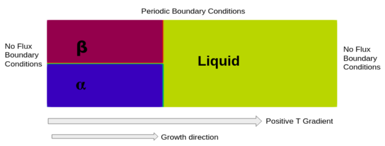
```

***Governing equations*** The basic idea of the phase-field model consists in the description of the evolution of individual phases using the corresponding set of order parameters (the phase-field variables). For each phase, the associated phase-field variable is equal to 1 inside the phase and vanishes to 0 outside the area occupied by the considered phase. The transition of phase fields from 1 to 0 at the phase boundaries is continuous and smooth, i.e.,the phase boundaries are represented by diffuse interfaces with a finite thickness. The three phases, $\alpha$, $\beta$ and liquid phase are described by three phase fields $\phi_i$, with $i = \alpha$, $\beta$, liq, representing the volume fractions. The state of the binary eutectic system is described by the order parameter ${\Phi} = \{\phi_{\alpha}, \phi_{\beta}, \phi_{liq}\}$, the chemical potential $\mu$, and the temperature $T$. The constraints on individual order parameters are:

$$
\phi_i~\epsilon~[0, 1]~\forall~i \\
\sum_i \phi_i = 1
\tag{2}
\label{2}
$$

* Phase evolution is determined by the phenomenological minimization of the grand-potential functional (@Choudhury). The evolution equations for three phases can be written as (@Plapp):

$$
\begin{aligned}
&{\tau}{\epsilon}{\frac {\partial \phi_i} {\partial t}} = -{\frac {2} {3}} \left[-{\epsilon}\left({\nabla}\cdot{\frac {\partial a({\nabla}{\Phi})} {\partial {\nabla}\phi_i}}\right) + {\frac {1} {\epsilon}}{\frac {\partial w({\Phi})} {\partial \phi_i}} + {\frac {\partial \Psi(T,\mu,{\Phi})} {\partial \phi_i}} \right] \\
&+ {\frac {1} {3}} \left[-{\epsilon}\left({\nabla}\cdot{\frac {\partial a({\nabla}{\Phi})} {\partial {\nabla}\phi_j}}\right) + {\frac {1} {\epsilon}}{\frac {\partial w({\Phi})} {\partial \phi_j}} + {\frac {\partial \Psi(T,\mu,{\Phi})} {\partial \phi_j}} \right] \\
&+ {\frac {1} {3}} \left[-{\epsilon}\left({\nabla}\cdot{\frac {\partial a({\nabla}{\Phi})} {\partial {\nabla}\phi_k}}\right) + {\frac {1} {\epsilon}}{\frac {\partial w({\Phi})} {\partial \phi_k}} + {\frac {\partial \Psi(T,\mu,{\Phi})} {\partial \phi_k}} \right]
\end{aligned}
\tag{3}
\label{3}
$$
where $i$, $j$ and $k$ are all different and $\epsilon ~\{\alpha, \beta, liq\}$; $\tau$ is the relaxation constant which influences the kinetics of the phase transformation at the interfaces.

* The double well potential $w({\Phi})$ can be written as:

$$
w({\Phi}) = \sum_i 9{\gamma}{\phi_i}^2(1-{\phi_i})^2
\tag{4}
\label{4}
$$

* The gradient energy density, $a({\nabla}{\Phi})$ has the form:

$$
a({\nabla}{\Phi}) = \sum_i {\gamma} |{\nabla}{\phi_i}|^2
\tag{5}
\label{5}
$$
where ${\gamma}$ controls the interfacial energy of the system and is known as surface energy density.

* The grand potential $\Psi (T,\mu,\phi)$ can be expressed as sum of grand potential of phases present in the system:

$$
\Psi (T,\mu,{\Phi}) = \sum_i \Psi_i (T,\mu) h_i({\Phi})
\tag{6}
\label{6}
$$
where $\Psi_i (T,\mu)$ for the three phases are the following:

$$
\Psi_\alpha (T,\mu) = -A \left({\frac {\mu - B_\alpha} {2A}}\right)^2 + D_\alpha(T) \\
\Psi_\beta (T,\mu) = -A \left({\frac {\mu - B_\beta} {2A}}\right)^2 + D_\beta(T) \\
\Psi_{liq} (T,\mu) = -A \left({\frac {\mu} {2A}}\right)^2
\tag{7}
\label{7}
$$
where $A$, $B_i$ and $D_i$ are derived following the consequence of equilibrium between the different phases described by the common tangent construction with parabolic approximation for free energy. These are given below:

$$
B_\alpha (T) = 2A_{liq}c^{eut}_{liq} - 2A_\alpha c^{eut}_\alpha + (T - T^{eut}) \left({\frac {2A_{liq}} {m_{liq-\alpha}}} - {\frac {2A_\alpha} {m_{\alpha-liq}}} \right) \\
B_\beta (T) = 2A_{liq}c^{eut}_{liq} - 2A_\beta c^{eut}_\beta + (T - T^{eut}) \left({\frac {2A_{liq}} {m_{liq-\beta}}} - {\frac {2A_\beta} {m_{\beta-liq}}} \right) \\
B_{liq} (T) = 0 \\
D_\alpha (T) = -A_{liq}(c^{eut}_{liq})^2 + A_\alpha (c^{eut}_\alpha)^2 + (T - T^{eut}) \left({\frac {-2A_{liq}c^{eut}_{liq}} {m_{liq-\alpha}}} + {\frac {2A_\alpha c^{eut}_\alpha} {m_{\alpha-liq}}} \right) \\
D_\beta (T) = -A_{liq}(c^{eut}_{liq})^2 + A_\beta (c^{eut}_\beta)^2 + (T - T^{eut}) \left({\frac {-2A_{liq}c^{eut}_{liq}} {m_{liq-\beta}}} + {\frac {2A_\beta c^{eut}_\beta} {m_{\beta-liq}}} \right) \\
D_{liq} (T) = 0
\tag{8}
\label{8}
$$
where $c^{eut}_i$ are the $\alpha$, $\beta$ and liquid phase compositions at the eutectic temperature, $T^{eut}$. The liquidus slopes for $\alpha-liq$ phase equilibrium is denoted by $m_{liq-\alpha}$ while the corresponding solidus slope by $m_{\alpha-liq}$ and similar notation is followed for the $\beta-liq$ phase equilibrium.

* In equation (6), $h_i({\Phi})$ is an interpolation function given as:

$$
h_i = {\frac {{\phi_i}^2} {4}} [15(1 - \phi_i)\{1 + \phi_i - (\phi_k - \phi_j)^2\} + {\phi_i}(9{\phi_i}^2 - 5)]
\tag{9}
\label{9}
$$
These interpolation functions make sure that at the interface of phases $i$ and $j$, the phase field for phase $k$ remains zero.

* The phase-field equations for three phases after incorporating above equations can be given as:

$$
\begin{aligned}
&{\tau}{\epsilon}{\frac {\partial \phi_i} {\partial t}} = -{\frac {2} {3}} \left[-2{\gamma}{\epsilon}{\nabla}^2 {\phi_i} + {\frac {1} {\epsilon}}{\frac {\partial w({\Phi})} {\partial \phi_i}} + \Psi_i (T,\mu) {\frac {\partial h_i({\Phi})} {\partial \phi_i}} \right] \\
&+ {\frac {1} {3}} \left[-2{\gamma}{\epsilon}{\nabla}^2 {\phi_j} + {\frac {1} {\epsilon}}{\frac {\partial w({\Phi})} {\partial \phi_j}} + \Psi_j (T,\mu) {\frac {\partial h_j({\Phi})} {\partial \phi_j}} \right] \\
&+ {\frac {1} {3}} \left[-2{\gamma}{\epsilon}{\nabla}^2 {\phi_k} + {\frac {1} {\epsilon}}{\frac {\partial w({\Phi})} {\partial \phi_k}} + \Psi_k (T,\mu) {\frac {\partial h_k({\Phi})} {\partial \phi_k}} \right]
\end{aligned}                    
\tag{10}
\label{10}
$$

* These three equations for the phase fields corresponding to the liquid, $\alpha$ and $\beta$ phases are solved in a coupled manner along with mass balance equation which takes the form:

$$
\begin{aligned}
&\left[\sum_i {\frac {\partial c_i} {\partial \mu}} h_i({\Phi})\right]{\frac {\partial \mu} {\partial t}} + \sum_i c_i \left(\sum_n {\frac {\partial h_i} {\partial \phi_n}} {\frac {\partial \phi_n} {\partial t}} \right) \\
&= \nabla \cdot \left(D \phi_{liq} {\frac {\partial c_{liq} (T,\mu)} {\partial \mu}} \nabla \mu \right) - \nabla \cdot j_{at}
\end{aligned}
\tag{11}
\label{11}
$$
The slope of $c$--$\mu$ curves is expressed according to the parabolic approximation for free energy in the solver source code:

$$
{\frac {\partial c_i (T,\mu)} {\partial \mu}} = {\frac {1} {2 A}}
\tag{12}
\label{12}
$$

* In this case diffusivity in solid phase is assumed to be negligible. This then becomes the case of one sided diffusion. For the case of one-sided diffusion, it has been shown in various previous works that there exists a thin-interface defect called solute trapping when simulations are performed with interface thicknesses, orders of magnitude larger than those of a real interface. The methodology proposed to correct this effect is the incorporation of an anti-trapping current $j_{at}$ in the evolution equation of the chemical potential. The anti-trapping term is incorporated as an additional flux of solute from the solid to the liquid in the normal direction to the interface (@Karma). To make sure that the anti-trapping current appears in the first-order correction to the chemical potential, the anti-trapping current is formulated into the following form:

$$
j_{at} = j_{at}^{\alpha \Longrightarrow liq} \left(-{\frac {{\nabla}\phi_\alpha} {|{\nabla}\phi_\alpha|}} \cdot {\frac {{\nabla}\phi_{liq}} {|{\nabla}\phi_{liq}|}} \right) + j_{at}^{\beta \Longrightarrow liq} \left(-{\frac {{\nabla}\phi_\beta} {|{\nabla}\phi_\beta|}} \cdot {\frac {{\nabla}\phi_{liq}} {|{\nabla}\phi_{liq}|}} \right)
\tag{13}
\label{13}
$$
where $j_{at}^{i \Longrightarrow liq}$ is:

$$
j_{at}^{i \Longrightarrow liq} = -{\frac {\epsilon} {2\sqrt{2}}} [c_{liq} (\mu) - c_i (\mu)] {\frac {\partial \phi_i} {\partial t}} {\frac {\nabla \phi_i} {|\nabla \phi_i|}}
\tag{14}
\label{14}
$$
All terms in the above equation are used in the nondimensional form, so $\epsilon$ is the nondimensional parameter related to the interface width and $t$ is the nondimensional time.

* As the simulation progresses, the solid-liquid interface will choose an undercooling and will traverse with the temperature gradient with the imposed velocity. Since the simulation of solidification begins from an infinite reservoir of liquid, it becomes necessary to implement shifts in all the fields in the domain to ensure that the far field composition of the liquid remains the same as eutectic composition. This is analogous to having a camera frame at the solid liquid interface which is moving along with it into a virtually infinite liquid in the growth direction. This is implemented simply by ‘rigidly convecting’ all the fields. This requires adding the flux term $v \cdot {\nabla}\phi$, where $v$ is the imposed velocity and $\phi$ is phase field parameter of all phases and also the chemical potential field. Since, $v$ is a constant, all these fields will simply be translated as it is in the entire domain. This shifts are required to be performed in the growth direction, which is chosen to be x direction. So, each equation becomes:

$$
\begin{aligned}
&{\tau}{\epsilon}{\frac {\partial \phi_i} {\partial t}} - v{\frac {\partial \phi_i} {\partial x}} = -{\frac {2} {3}} \left[-2{\gamma}{\epsilon}{\nabla}^2 {\phi_i} + {\frac {1} {\epsilon}}{\frac {\partial w({\Phi})} {\partial \phi_i}} + \Psi_i (T,\mu) {\frac {\partial h_i({\Phi})} {\partial \phi_i}} \right] \\
&+ {\frac {1} {3}} \left[-2{\gamma}{\epsilon}{\nabla}^2 {\phi_j} + {\frac {1} {\epsilon}}{\frac {\partial w({\Phi})} {\partial \phi_j}} + \Psi_j (T,\mu) {\frac {\partial h_j({\Phi})} {\partial \phi_j}} \right] \\
&+ {\frac {1} {3}} \left[-2{\gamma}{\epsilon}{\nabla}^2 {\phi_k} + {\frac {1} {\epsilon}}{\frac {\partial w({\Phi})} {\partial \phi_k}} + \Psi_k (T,\mu) {\frac {\partial h_k({\Phi})} {\partial \phi_k}} \right]
\end{aligned}                    
\tag{15}
\label{15}
$$
and the chemical diffusion evolution equation becomes:

$$
\begin{aligned}
&\left[\sum_i {\frac {\partial c_i} {\partial \mu}} h_i({\Phi})\right]{\frac {\partial \mu} {\partial t}} - v{\frac {\partial c} {\partial x}} + \sum_i c_i \left(\sum_n {\frac {\partial h_i} {\partial \phi_n}} {\frac {\partial \phi_n} {\partial t}} \right) \\
&= \nabla \cdot \left(D \phi_{liq} {\frac {\partial c_{liq} (T,\mu)} {\partial \mu}} \nabla \mu \right) - \nabla \cdot j_{at}
\end{aligned}
\tag{16}
\label{16}
$$
Since each of the fields is being moved in the direction opposite to growth direction, the temperature gradient is kept stationary and solid-liquid interface is expected to find its equilibrium undercooling.

* Using the relation ${\frac {\partial \Psi (T,\mu,{\Phi})} {\partial \mu}} = -c$ and equations (6--9), $\nabla c$ is evaluated.

***Boundary conditions***

* Cyclic boundary condition is specified at the top and bottom planes, and zero-flux is specified at the remaining planes.

***Initial conditions***

* $\phi_i =$ 1.0 inside the phase $i$ and 0 inside phases $j$ and $k$ (with $i, j, k ~\epsilon ~\{\alpha, \beta, liq\}$) (see Figure 1).

* $\mu =$ 1.0 in the entire domain.

***Physical properties*** The nondimensionalized physical properties are:

* Slope liquidus of $liq-\alpha$ ($m_{liq-\alpha}$) = Slope solidus of $\alpha-liq$ ($m_{\alpha-liq}$) = -0.5

* Slope liquidus of $liq-\beta$ ($m_{liq-\beta}$) = Slope solidus of $\beta-liq$ ($m_{\beta-liq}$) = 0.5

* Eutectic composition of liquid phase ($c^{eut}_{liq}$) = 0.5

* Eutectic composition of $\alpha$ phase ($c^{\alpha}$) = 0.2

* Eutectic composition of $\beta$ phase ($c^{\beta}$) = 0.8

* Thermal gradient ($G$) = 1.7e-5

* Velocity ($v$) = 0.001

* Diffusivity in liquid ($D$) = 1

* Eutectic temperature ($T_{eut}$) = 1.0

* Constant value from temperature profile ($T_{initial}$) = 0.93

* Relaxation coefficient ($\tau$) = 0.144

* Interface energy parameter ($\gamma$) = 1

* Interface width parameter ($\epsilon$) = 4

***Solver name***

* *eutectic*: An implementation for phase-field method to model eutectic transformation of two solid phases from liquid phase.

***Case name***

* *eutecticGrowth2D*, located in the *\$FOAM_RUN/PhaseFieldSolverEutectic* directory.

The problem is solved using *eutectic*, located in the *\$FOAM_RUN/PhaseFieldSolverEutectic* directory. The code-guide for this solver is given in the *\$FOAM_RUN/PhaseFieldSolverEutectic/codeGuide* directory. Before proceeding further, it may be helpful for the user to become familiar with [OpenFOAM documentation](https://www.openfoam.com/documentation/overview "OpenFOAM documentation").

## Pre-processing

To prepare case files and running the case, the user can change to the case directory:

cd \$FOAM_RUN/PhaseFieldSolverEutectic/eutecticGrowth2D

### Mesh generation

OpenFOAM solves the case in three dimensions by default but can be instructed to solve in two dimensions. Here, the mesh must be 1 cell layer thick. The domain consists of a square of side length of 12000 in the x-y plane. Large variations in fields can be expected near the left and bottom boundaries, so the mesh will be graded to be smaller in this region. A graded mesh of 250 by 250 cells will be used initially. The block structure is shown in Figure 2.

```{r quarter, echo=FALSE, out.width='50%', fig.align = 'center', fig.cap = "Figure 2: Block structure of the mesh."}
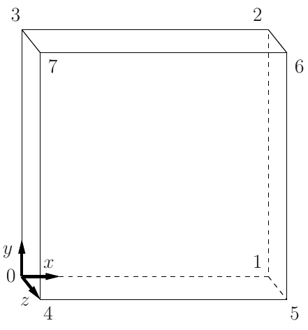
```

The entries in *blockMeshDict* located in the *system* directory for this case are as follows:

```{r comment='', echo=FALSE}
cat(readLines('~/Documents/run/PhaseFieldSolverEutectic/eutecticGrowth2D/system/blockMeshDict'), sep = '\n')
```

The mesh is generated after accessing blockMesh entry within *\$FOAM_RUN/PhaseFieldSolverEutectic/eutecticGrowth2D/Allrun*:

```{r comment='', echo=FALSE}
cat(readLines('~/Documents/run/PhaseFieldSolverEutectic/eutecticGrowth2D/Allrun'), sep = '\n')
```

The logs are stored into *log.blockMesh*.

### Boundary and initial conditions

Once the mesh generation is complete, the user can look at this initial conditions set up for this case. The case is set up to start at time $t$ = 0 s, so the initial field data is stored in a *0* sub-directory of the *freeGrowth* directory. The *0* sub-directory contains *phi_alpha.orig*, *phi_beta.orig*, *phi_liq.orig*, and *mu.orig*, one for each of the phase parameter ($\phi_{\alpha}, \phi_{\beta}, \phi_{liq}$) and chemical potential ($\mu$) fields whose initial values and boundary conditions must be set. First, the file *phi_alpha.orig* can be examined:

```{r comment='', echo=FALSE}
cat(readLines('~/Documents/run/PhaseFieldSolverEutectic/eutecticGrowth2D/0/phi_alpha.orig'), sep = '\n')
```

For this case, the boundary consists of planes split into patches named: (1) floor and ceiling for cyclic boundary at top and bottom planes; (2) sideSolid patch includes other planes of the 2D case and is given a zeroGradient boundary condition for $\phi_alpha$, meaning “the normal gradient of $\phi_{\alpha}$ is zero”. The initial fields are set to uniform zero.

The user can similarly examine *0/phi_beta.orig*, *0/phi_liq.orig*, and the chemical potential field in the *0/mu.orig* file. The non-dimensionalized internal field is initialised as uniform zero. The boundary fields require the same boundary condition.

```{r comment='', echo=FALSE}
cat(readLines('~/Documents/run/PhaseFieldSolverEutectic/eutecticGrowth2D/0/phi_beta.orig'), sep = '\n')
```

```{r comment='', echo=FALSE}
cat(readLines('~/Documents/run/PhaseFieldSolverEutectic/eutecticGrowth2D/0/phi_liq.orig'), sep = '\n')
```

```{r comment='', echo=FALSE}
cat(readLines('~/Documents/run/PhaseFieldSolverEutectic/eutecticGrowth2D/0/mu.orig'), sep = '\n')
```

### Setting initial field

A non-uniform initial condition is specified for the phase parameter, $\phi_i$, where $\phi_i =$ 1.0 inside the phase $i$ and 0 inside phases $j$ and $k$ (with $i, j, k ~\epsilon ~\{\alpha, \beta, liq\}$). And for chemical potential, $\mu$, where $\mu =$ 1.0 in the entire domain.

This is achieved by running the setFields utility. It requires a *setFieldsDict* dictionary, located in the *system* directory, whose entries for this case are shown below:

```{r comment='', echo=FALSE}
cat(readLines('~/Documents/run/PhaseFieldSolverEutectic/eutecticGrowth2D/system/setFieldsDict'), sep = '\n')
```

The user can execute setFields through *\$FOAM_RUN/PhaseFieldSolverEutectic/eutecticGrowth2D/Allrun*. The logs are stored into *log.setFields*.

### Physical properties

The physical properties for the case are specified in *constant/transportProperties* dictionary. The entries of *transportProperties* dictionary are shown below:

```{r comment='', echo=FALSE}
cat(readLines('~/Documents/run/PhaseFieldSolverEutectic/eutecticGrowth2D/constant/transportProperties'), sep = '\n')
```

The physical properties are read by *readTransportProperties.H* while running the case.

### Time step control

Input data relating to the control of time, reading and writing of the solution data are read from the *controlDict* dictionary located in the *system* directory.

The run is started at time $t =$ 0 to read field data from a directory named *0*. Therefore, the startFrom keyword is set to startTime and then the startTime keyword to be 0.

The end time can be considered to be the time taken for the primary dendrites to reach the boundaries, which is found to be 3000000 for this case. To specify this end time, the stopAt keyword is set to endTime and then the endTime keyword to 3000000.

Next, the time step must be fixed which is represented by the keyword deltaT. To achieve temporal accuracy and numerical stability while reducing computational effort, deltaT is set to 200.

As the simulation progresses, results written at certain intervals of time can later be viewed with a post-processing package. The writeControl keyword can be set to the runTime option, where the time interval for writing is specified under the writeInterval keyword. The writeInterval can be set to 100000. OpenFOAM creates a new directory named after the current time, e.g. 500000, on each occasion that it writes a set of data containing the results for each field, $\phi_i$ and $\mu$, into the time directories. For this case, the entries in the *controlDict* are shown below:


```{r comment='', echo=FALSE}
cat(readLines('~/Documents/run/PhaseFieldSolverEutectic/eutecticGrowth2D/system/controlDict'), sep = '\n')
```

### Discretisation schemes

In this case, the term $\nabla \cdot \left(D \phi_{liq} {\frac {\partial c_{liq} (T,\mu)} {\partial \mu}} \nabla \mu \right)$ in the chemical potential equation includes laplacian(D*phi_liq,mu). The laplacian is solved by fixing laplacianSchemes to Gauss linear corrected. The gradient and divergence are solved by fixing gradSchemes and divSchemes to Gauss linear.

The other discretised terms use commonly employed schemes so that the *fvSchemes* dictionary entries should therefore be:

```{r comment='', echo=FALSE}
cat(readLines('~/Documents/run/PhaseFieldSolverEutectic/eutecticGrowth2D/system/fvSchemes'), sep = '\n')
```

### Solver settings

In the *fvSolution*, the solver tolerance should be set to 10$^{-6}$ for this case. The solver relative tolerance, denoted by relTol, is set to 0.

```{r comment='', echo=FALSE}
cat(readLines('~/Documents/run/PhaseFieldSolverEutectic/eutecticGrowth2D/system/fvSolution'), sep = '\n')
```
The *fvSolution* dictionary contains a sub-dictionary, SIMPLE that contains a control parameter nNonOrthogonalCorrectors set to 0. The description of other options can be found in the OpenFOAM userguide.

## Running the application

The first step to run a parallel case is to decompose the domain using the decomposePar utility for assigning to different processors. The dictionary associated with decomposePar, *decomposeParDict* is located in the *system* directory. The first entry is numberOfSubdomains corresponding to the number of processors available for the case. The method of decomposition can be simple. The domain is split into subdomains, in the x, y and z directions, the number of subdomains in each direction being given by the vector n. As this geometry is two dimensional, the 3rd direction, z, cannot be split, hence n$_z$ must be 1. The n$_x$ and n$_y$ components of n split the domain in the x and y directions following n$_x$n$_y$ = numberOfSubdomains. To minimize the communication time between the processors, the number of cell faces adjoining the subdomains are kept to a minimum. For growth direction parallel to x, the domain is split in the y direction to have optimum load balance. The delta keyword is set to 0.001.

For this case, numberOfSubdomains = 4 and n = (1, 4, 1). When executing *Allrun*, decomposePar is run. The logs are stored into *log.decomposePar*.

```{r comment='', echo=FALSE}
cat(readLines('~/Documents/run/PhaseFieldSolverEutectic/eutecticGrowth2D/system/decomposeParDict'), sep = '\n')
```

After compiling the solver (see *codeGuide*), it is executed parallely using runParallel within *Allrun*. The progress of the job is stored into *log.phaseFieldDynamic*. It includes the current time, initial and final residuals for all fields.

## Post-processing

Once the case has completed running, the decomposed fields and mesh from processor directories can be reconstructed for post-processing. Using reconstructPar, the decomposed mesh with fields can be reassembled. The results reconstructed to time directories can be viewed using ParaView by creating and opening *eutecticGrowth2D.foam* case module:

cd \$FOAM_RUN/PhaseFieldSolverEutectic/eutecticGrowth2D

touch eutecticGrowth2D.foam

paraview eutecticGrowth2D.foam

The evolution of phase-field profile corresponding to three time steps are shown in Figure 4-6.

```{r first, echo=FALSE, out.width='50%', fig.align = 'center', fig.cap = "Figure 4: Phase-field profile at time 100000."}
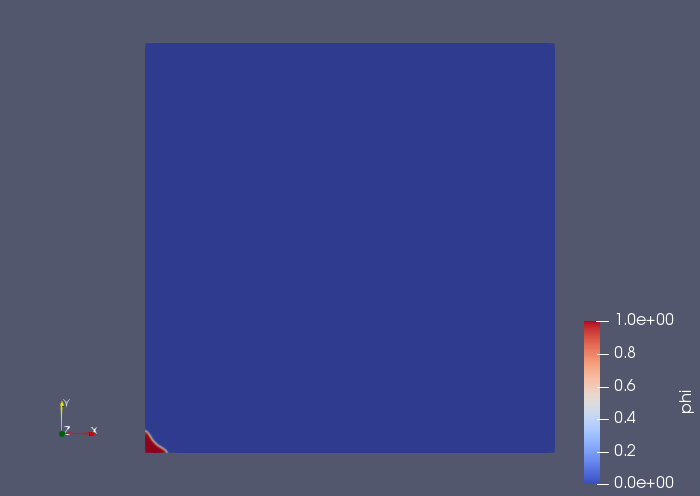
```

```{r second, echo=FALSE, out.width='50%', fig.align = 'center', fig.cap = "Figure 5: Phase-field profile at time 1000000."}
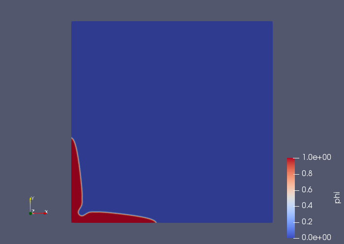
```

```{r third, echo=FALSE, out.width='50%', fig.align = 'center', fig.cap = "Figure 6: Phase-field profile at time 2500000."}
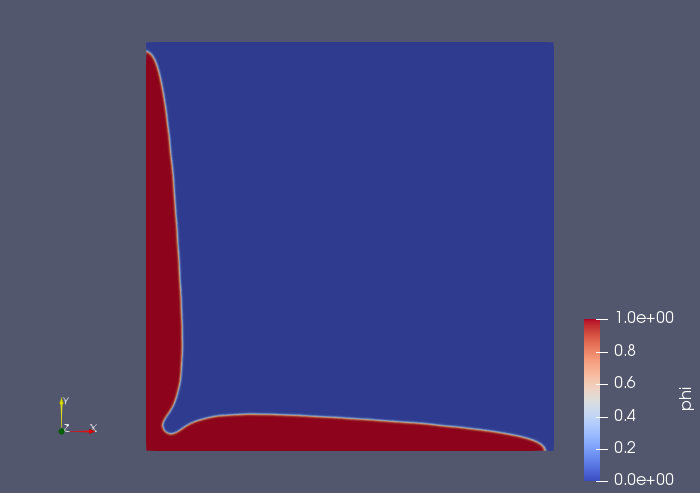
```

As can be seen from the figures, in absence of thermal gradient, the solidification happens in the form of freely growing dendrites (@Choudhury). Also, the chemical potential plot at time 2500000 is shown in Figure 7.

```{r fourth, echo=FALSE, out.width='50%', fig.align = 'center', fig.cap = "Figure 7: Chemical potential at time 2500000."}
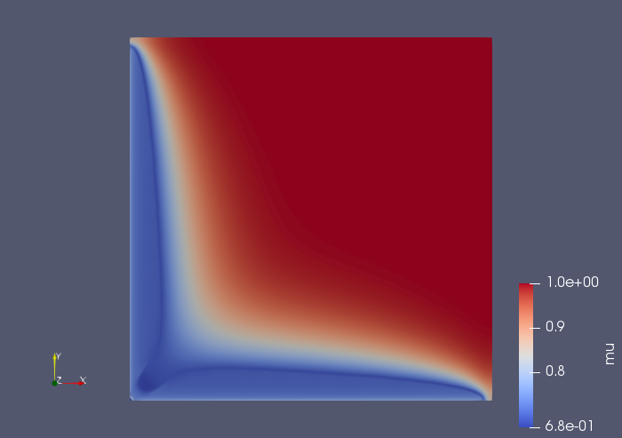
```

# Directional solidification

The second case is performed by subjecting the melt to a positive thermal gradient ahead of the solid-liquid interface. The imposed temperature field as a function of thermal gradient in the x direction, $G$ and pulling velocity, $v$ is taken as:

$$
T(x,t) = T_{initial} + G(x-vt)
\tag{167}
\label{167}
$$

## Problem specification

***Solution domain*** The domain is considered to be two-dimensional in this problem. The rectangular domain consists of an undercooled region as shown in Figure 8.

```{r geomds, echo=FALSE, out.width='50%', fig.align = 'center', fig.cap = "Figure 8: Geometry of the melt with an undercooled region."}
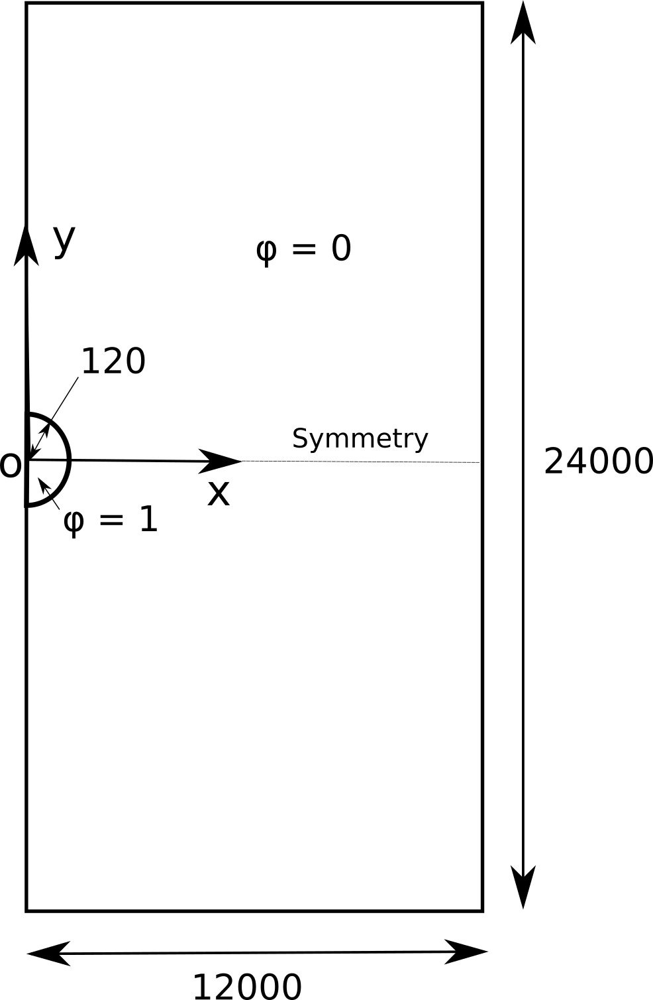
```

***Governing equations*** The governing equations used are same as in section 1.1.

***Boundary conditions*** Zero-flux is specified at all planes.

***Initial conditions*** The initial conditions are same as in section 1.1.

***Physical properties*** The physical properties are same as in section 1.1 except the following (in order to impose thermal gradient and velocity in the x direction):

* Thermal gradient ($G$) = 1.7e-5

* Velocity ($v$) = 0.001

***Solver name*** *phaseFieldDynamic*: An implementation with dynamic interface refinement for phase-field method to model solidification of two-phase two-component system.

***Case name*** *directionalSolidification*, located in the *\$FOAM_RUN/PhaseFieldSolverDynamic* directory.

## Pre-processing

To prepare case files and running the case, the user can change to the case directory:

cd \$FOAM_RUN/PhaseFieldSolverDynamic/directionalSolidification

### Mesh generation

The overall process of generating the mesh remains same as in section 1.2.1. However, this case is a symmetric problem. So, only the top half of the whole geometry (shown in Figure 8) is considered. Similarly, graded mesh of 250 by 250 cells (with smaller cells near the left and bottom boundaries) will be used. The entries in *blockMeshDict* located in the *system* directory for this case are as follows:

```{r comment='', echo=FALSE}
cat(readLines('~/Documents/run/PhaseFieldSolverEutectic/eutecticGrowth2D/system/blockMeshDict'), sep = '\n')
```

### Boundary and initial conditions

Similar to section 1.2.2, the file *phi.orig* in *0* sub-directory of the *directionalSolidification* directory can be examined:

```{r comment='', echo=FALSE}
cat(readLines('~/Documents/run/PhaseFieldSolverEutectic/eutecticGrowth2D/0/phi_alpha.orig'), sep = '\n')
```

For this case, the boundary consists of symmetryPlane, only for patch named floor for the bottom symmetric boundary. The remaining planes of the 2D case are given a zeroGradient boundary condition.

The boundary field for chemical potential requires the same boundary condition.

```{r comment='', echo=FALSE}
cat(readLines('~/Documents/run/PhaseFieldSolverEutectic/eutecticGrowth2D/0/mu.orig'), sep = '\n')
```

### Setting initial field

The entries of *setFieldsDict* dictionary for this case are kept same as section 1.2.3.

### Physical properties

The entries of *transportProperties* dictionary are shown below:

```{r comment='', echo=FALSE}
cat(readLines('~/Documents/run/PhaseFieldSolverEutectic/eutecticGrowth2D/constant/transportProperties'), sep = '\n')
```

It must be noted that, thermal gradient, $G$ and velocity, $v$ are nonzero for directional solidification. The remaining entries are same as section 1.2.4.

### Time step control

Similar to section 1.2.5, the startTime and deltaT are specified. The endTime keyword is set to 6000000 to observe the growth of secondary dendrites from the primary dendrite, growing normal to the direction of imposed thermal gradient. The writeInterval can be set to 200000. For this case, the entries in the *controlDict* are shown below:

```{r comment='', echo=FALSE}
cat(readLines('~/Documents/run/PhaseFieldSolverEutectic/eutecticGrowth2D/system/controlDict'), sep = '\n')
```

### Discretisation schemes and solver settings

The *fvSchemes* and *fvSolution* dictionary entries are kept same as section 1.2.6 and 1.2.7.

## Running the case

For this case, the primary dendrite can be expected to grow in the y direction since the thermal gradient is applied in the x direction. Consequently, the secondary dendrites will grow almost uniformly in the x direction (as will be seen later in section 2.5). In order to balance the load between the processors, in the presence of dynamic interface refinement and without stopping the run unlike section 1.3, the subdomains are divided in the y direction. Hence, numberOfSubdomains = 4 and n = (1, 4, 1) are set.

```{r comment='', echo=FALSE}
cat(readLines('~/Documents/run/PhaseFieldSolverEutectic/eutecticGrowth2D/system/decomposeParDict'), sep = '\n')
```

Similar to section 1.3, the solver for this case is run parallely using runParallel within *Allrun*.

## Post-processing

Similar to section 1.4, the results reconstructed to time directories can be viewed by creating and opening the *directionalSolidification.foam* case module using ParaView. The evolution of phase-field profile corresponding to three time steps are shown in Figure 9-11.

```{r firstb, echo=FALSE, out.width='50%', fig.align = 'center', fig.cap = "Figure 9: Phase-field profile at time 200000."}
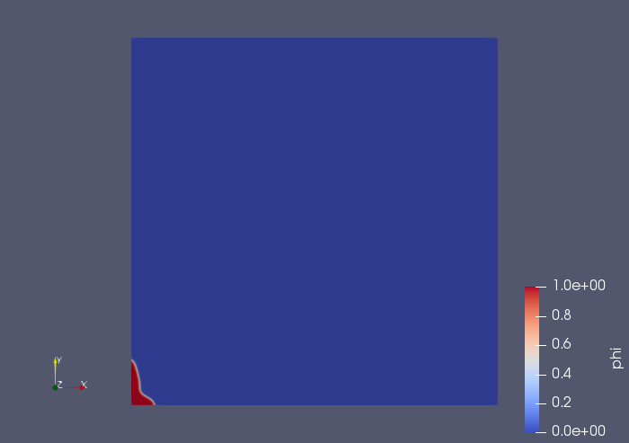
```

```{r secondb, echo=FALSE, out.width='50%', fig.align = 'center', fig.cap = "Figure 10: Phase-field profile at time 800000."}
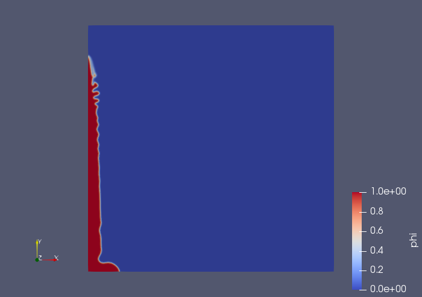
```

```{r thirdb, echo=FALSE, out.width='50%', fig.align = 'center', fig.cap = "Figure 11: Phase-field profile at time 3600000."}
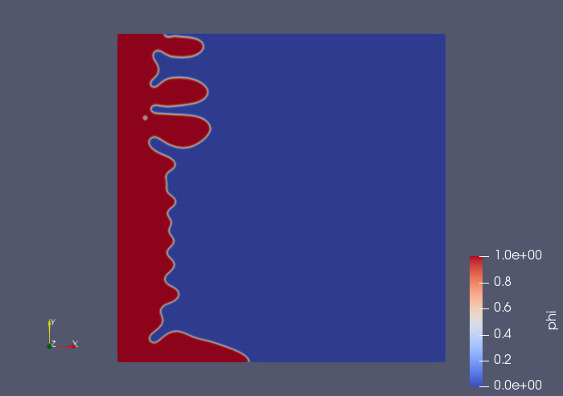
```

As can be seen from the figures, in the presence of thermal gradient and velocity in the x direction, the primary dendrite grows in the y direction. Later, secondary dendrites start to grow from the primary dendrite unlike the *freeGrowth* case in section 1.4. Also, the chemical potential plot at time 3600000 is shown in Figure 12.

```{r fourthb, echo=FALSE, out.width='50%', fig.align = 'center', fig.cap = "Figure 12: Chemical potential at time 3600000."}
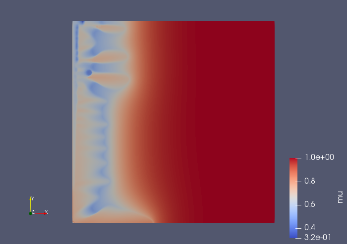
```

# References